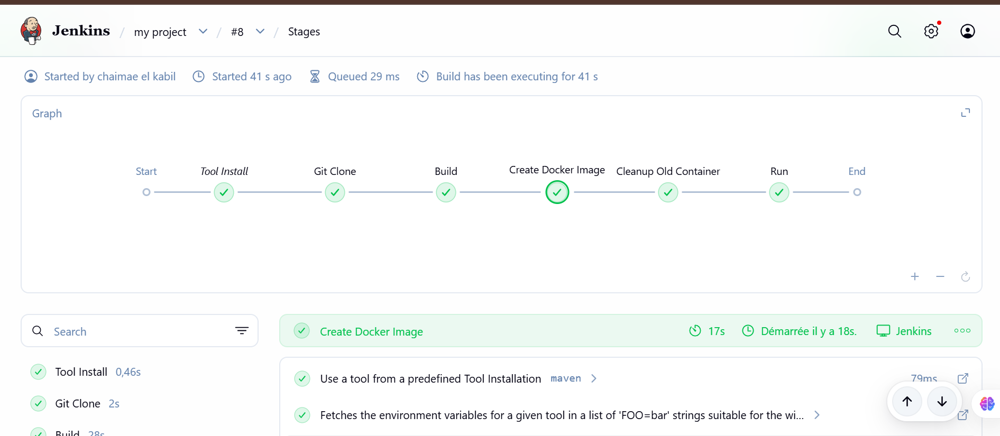
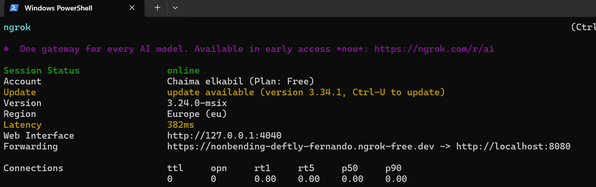
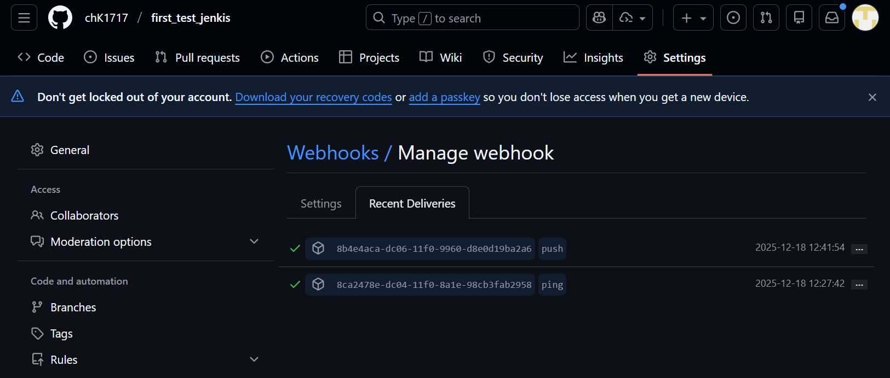
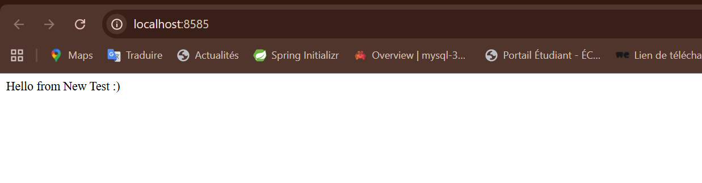
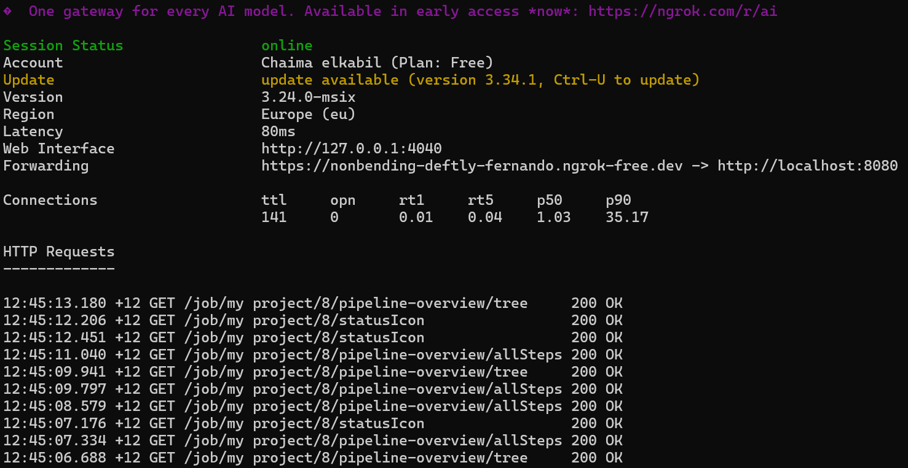

# Projet Jenkins CI/CD - Spring Boot avec Docker

## Description
Ce projet démontre l'intégration continue et le déploiement continu (CI/CD) d'une application Spring Boot en utilisant Jenkins, Docker et GitHub Webhooks.

## Technologies utilisées
- **Spring Boot** - Framework Java pour l'application web
- **Maven** - Outil de build et gestion des dépendances
- **Docker** - Conteneurisation de l'application
- **Jenkins** - Serveur d'intégration continue
- **GitHub** - Gestionnaire de version et hébergement du code
- **ngrok** - Tunnel pour les webhooks GitHub vers Jenkins local

## Architecture du projet

```
POV-JAVA/
├── src/
│   ├── main/
│   │   ├── java/
│   │   │   └── com/example/Point/of/sale/
│   │   │       ├── PointOfSaleApplication.java
│   │   │       └── controller/
│   │   │           └── HelloController.java
│   │   └── resources/
│   │       └── application.properties
│   └── test/
├── Dockerfile
└── pom.xml
```

## Configuration du Pipeline Jenkins

Le pipeline Jenkins est configuré pour exécuter automatiquement les étapes suivantes lors d'un push sur GitHub :

### Étapes du Pipeline

1. **Git Clone** - Récupération du code source depuis GitHub
2. **Build** - Compilation et tests avec Maven (`mvn clean install`)
3. **Create Docker Image** - Construction de l'image Docker
4. **Cleanup Old Container** - Suppression du conteneur précédent
5. **Run** - Démarrage du nouveau conteneur sur le port 8585

## Installation et Configuration

### Prérequis
- Java 17+
- Maven 3.6+
- Docker Desktop
- Jenkins
- ngrok

### 1. Cloner le projet
```bash
git clone https://github.com/chK1717/first_test_jenkis.git
cd first_test_jenkis
```

### 2. Build local
```bash
cd POV-JAVA
mvn clean install
```

### 3. Configuration Jenkins
1. Créer un nouveau job Pipeline nommé "my project"
2. Configurer le GitHub project URL : `https://github.com/chK1717/first_test_jenkis`
3. Activer "GitHub hook trigger for GITScm polling"
4. Utiliser le Jenkinsfile fourni

### 4. Configuration du Webhook GitHub
1. Démarrer ngrok : `ngrok http 8080`
2. Dans GitHub → Settings → Webhooks
3. Payload URL : `http://<ngrok-url>/github-webhook/`
4. Content type : `application/json`
5. Événements : `Just the push event`

## Captures d'écran

### Pipeline Jenkins en cours d'exécution


### Configuration ngrok


### Webhook GitHub configuré


### Application déployée


### Build terminé avec succès


## Utilisation

### Lancer l'application localement
```bash
cd POV-JAVA
mvn spring-boot:run
```

### Construire l'image Docker manuellement
```bash
cd POV-JAVA
docker build -t chk1717/pos .
```

### Lancer le conteneur Docker
```bash
docker run --name test-pos -d -p 8585:8282 chk1717/pos
```

### Accéder à l'application
Ouvrir dans le navigateur : `http://localhost:8585`

Réponse attendue :
```
Hello from New Test :)
```

## Endpoints disponibles

| Endpoint | Méthode | Description |
|----------|---------|-------------|
| `/` | GET | Message de bienvenue |
| `/user` | GET | Retourne "Users" |

## Workflow CI/CD

```
Code modifié → Git Push → GitHub Webhook → ngrok → Jenkins
    ↓
Pipeline Jenkins :
    1. Clone du code
    2. Build Maven
    3. Création image Docker
    4. Nettoyage conteneur existant
    5. Démarrage nouveau conteneur
    ↓
Application déployée sur http://localhost:8585
```

## Jenkinsfile

Le pipeline est défini dans le fichier `Jenkinsfile` à la racine du projet. Il utilise :
- Maven pour le build
- Docker pour la conteneurisation
- Commandes Windows batch (`bat`)

## Dépannage

### Le build Maven échoue
Vérifier que vous êtes dans le dossier POV-JAVA :
```bash
cd POV-JAVA
mvn clean install
```

### Le conteneur existe déjà
Supprimer le conteneur existant :
```bash
docker rm -f test-pos
```

### Le webhook ne fonctionne pas
1. Vérifier que ngrok est en cours d'exécution
2. Vérifier l'URL du webhook dans GitHub
3. Consulter "Recent Deliveries" dans GitHub Webhooks

## Auteur
Projet réalisé dans le cadre d'un TP Jenkins CI/CD

## Licence
Ce projet est à usage éducatif.
